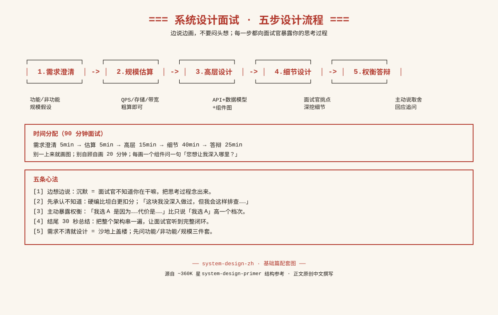

<div align="center">

# 系统设计面试手册 · 中文版

### 90 分钟拿下系统设计面试？这份源自 **~360K 星** 的 system-design-primer 结构思路、全部由中文原创撰写的手册，帮你把白板前要讲的话梳理干净。

<br>



</div>

---

## 这是什么

这是一份面向中文工程师的**系统设计面试自学手册**。它参考了 GitHub 上知名开源项目 [`donnemartin/system-design-primer`](https://github.com/donnemartin/system-design-primer)（约 36 万星）的**结构思路**——把面试要准备的内容拆成「基础概念 / 设计流程 / 经典案例 / 规模估算」四块——但**全部正文为原创中文撰写**，没有翻译原文，也没有直接搬运任何句子。

你不需要啃英文长文，也不用在面试前一晚临时抱佛脚。翻开对应章节，按「是什么 / 关键点（可背）/ 面试怎么答 / 常见追问」四段式过一遍，白板上就有话讲。

## 适合谁

- 1-5 年后端工程师，准备大厂/外企系统设计面试。
- 工作中天天写 CRUD，但被问到「这个系统怎么设计」就卡住。
- 看过很多博客，但知识点零散，串不成一个完整架构。

## 目录

### 基础篇速查表（想准备哪块 → 打开哪篇）

| 你想复习的话题 | 打开这篇 |
|----------------|----------|
| CAP 定理、一致性模型、可用性/扩展性 | [01-foundations.md](system-design/01-foundations.md) |
| 负载均衡、缓存策略、消息队列 | [01-foundations.md](system-design/01-foundations.md) |
| SQL vs NoSQL、分布式 ID、微服务 | [01-foundations.md](system-design/01-foundations.md) |
| 幂等、重试、限流 | [01-foundations.md](system-design/01-foundations.md) |
| 面试答题五步流程、白板话术 | [02-process.md](system-design/02-process.md) |
| QPS/存储/带宽估算套路 | [13-numbers.md](system-design/13-numbers.md) |

### 经典案例目录（10 个高频题）

| # | 案例 | 考点关键词 |
|---|------|-----------|
| 03 | [URL 短链](system-design/03-url-shortener.md) | 发号器、base62、缓存、302 vs 301 |
| 04 | [网页爬虫](system-design/04-web-crawler.md) | URL 去重、布隆过滤器、politeness |
| 05 | [新闻 Feed 流](system-design/05-news-feed.md) | 推/拉模式、扇出、inbox |
| 06 | [聊天系统](system-design/06-chat.md) | 长连接、消息路由、不丢不重 |
| 07 | [在线支付](system-design/07-payment.md) | 幂等、状态机、对账、回调兜底 |
| 08 | [购物车](system-design/08-shopping-cart.md) | Redis 热存、登录合并、价格实时 |
| 09 | [搜索系统](system-design/09-search.md) | 倒排索引、ES、近实时写入 |
| 10 | [推荐系统](system-design/10-recommendation.md) | 召回+精排、向量检索、冷启动 |
| 11 | [日志监控](system-design/11-logging-monitoring.md) | 采集、冷热分层、告警 |
| 12 | [限流网关](system-design/12-rate-limiter.md) | 令牌桶、Redis+Lua、多级限流 |

每个案例都按六段式写：**需求 → 估算 → 高层设计 → 核心组件细节 → 权衡 → 追问点**。

## 怎么用

```
第 1 周：通读 01-foundations，把每个概念的「关键点」背下来
第 2 周：过 02-process，找朋友模拟白板答题
第 3-4 周：每天精读 1 个案例，对着图自己复述一遍
面试前一晚：翻 13-numbers 速查数字 + 每个案例的「追问点」
```

## 为什么值得 Star

- **全中文原创**：不是机翻，是按中国工程师面试习惯重新组织的话术。
- **四段式模板**：每个概念都能直接背成面试回答。
- **六段式案例**：每个案例都覆盖需求澄清到权衡答辩的完整流程。
- **ASCII 图**：3 张终端风信息图，打印出来贴墙复习。
- **持续更新**：后续会补更多案例（分布式 ID、秒杀、库存等）。

## 开源许可

- 本仓库代码与文档采用 [MIT License](LICENSE)。
- 结构思路参考自 [donnemartin/system-design-primer](https://github.com/donnemartin/system-design-primer)（CC BY 4.0），详见 [THIRD_PARTY_NOTICES.md](THIRD_PARTY_NOTICES.md)。
- 本仓库所有正文为原创撰写，未翻译或复制原文句子。

---

<div align="center">

**如果这份手册帮你拿到了 offer，欢迎回来看一眼，给个 Star 告诉作者一声。**

</div>
